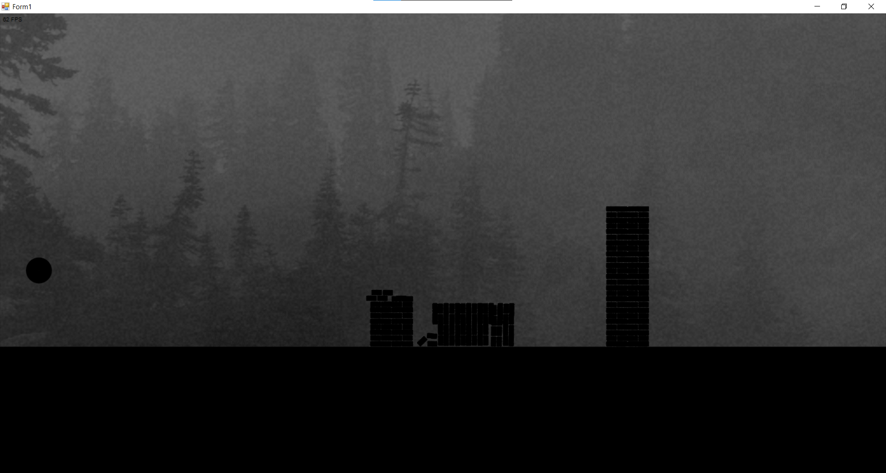
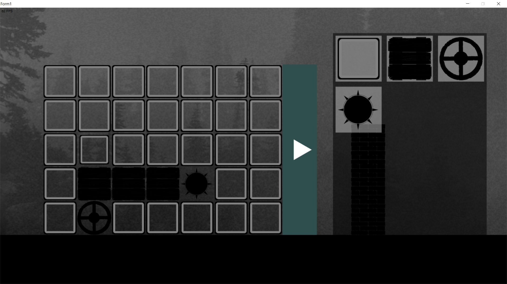
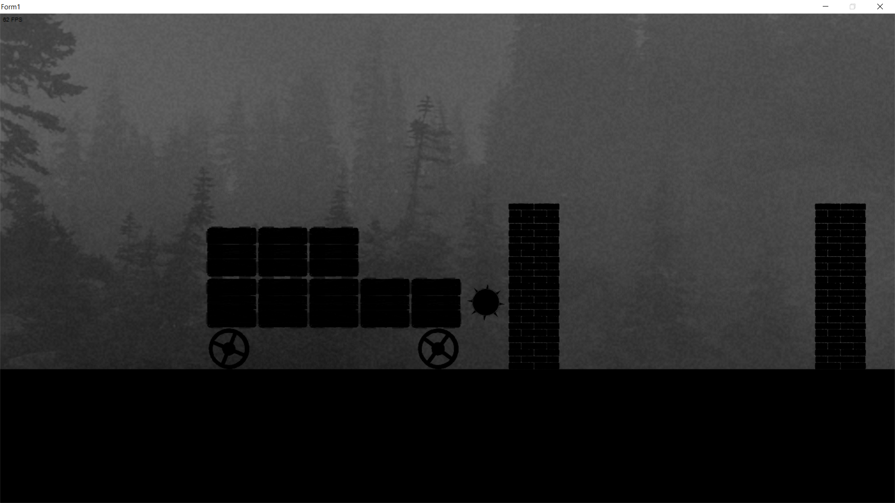

# Проектъ &laquo;Игра&raquo;
Игра, основанная на физикѣ, въ которой игроку предстоитъ строить осадныя машины для разрушенiя замковъ, стоящихъ
по пути въ игровомъ мирѣ.

## Управленiѣ

 - ПКМ - управленiе камерой
 - A, D - управленiе машиной (ежели токмо у оной колёса есть, конечно)

## Изображенiя

- Просто сцена для тестированiя физики

> 21 апреля

- Дебагъ, нормальная система координатъ

> 28 апреля

- Модель разрушаемой кирпичной стены, многопоточность

> 8 мая

- Фонъ

> 12 мая

- Интерфейсъ редактора осадныхъ машинъ

> 13 мая

- Рабочiй редакторъ

> 16 мая

## Геймплей
На каждомъ уровнѣ открываѣтся
редакторъ для постройки осадной машины,
чтобы использовать оную для разрушенiя вражескихъ сооруженiй,
продвиженiя вперёдъ, открытiя новыхъ уровней (хотя, собственно, сами эти уровни реализованы не были).
