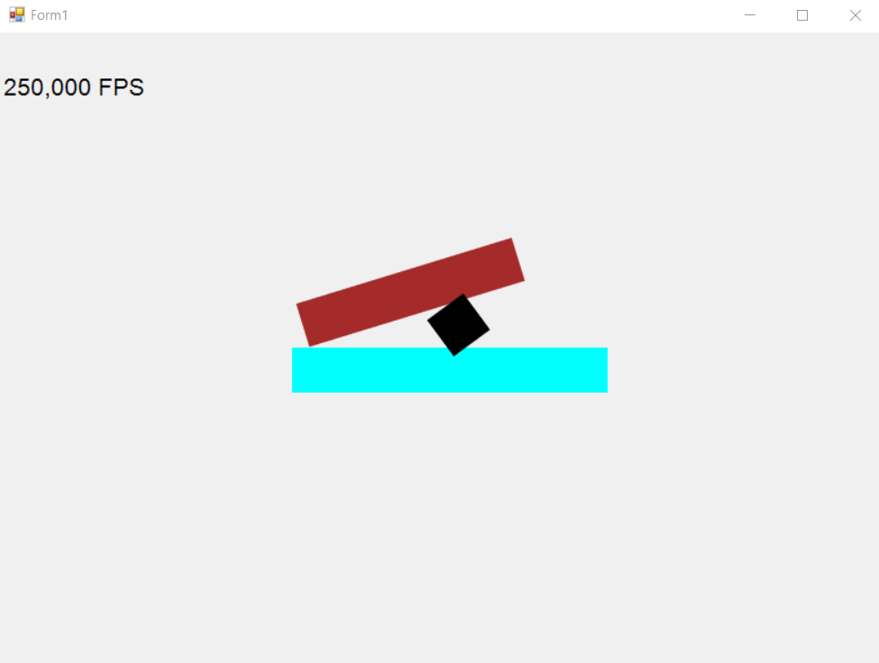

# GameProject
Игра, основанная на физике, в которой игроку предстоит строить осадные машины для разрушения замков, стоящих
по пути в игровом мире.

## Сейчас выглядит так

(Просто сцена для тестирования физики)

## Геймплей
В начале игрок оказывается линейном мире, на котором отмечены контрольные точки. На каждой точке открывается
редактор для постройки осадной машины, чтобы использовать оную для продвижения вперёд.
