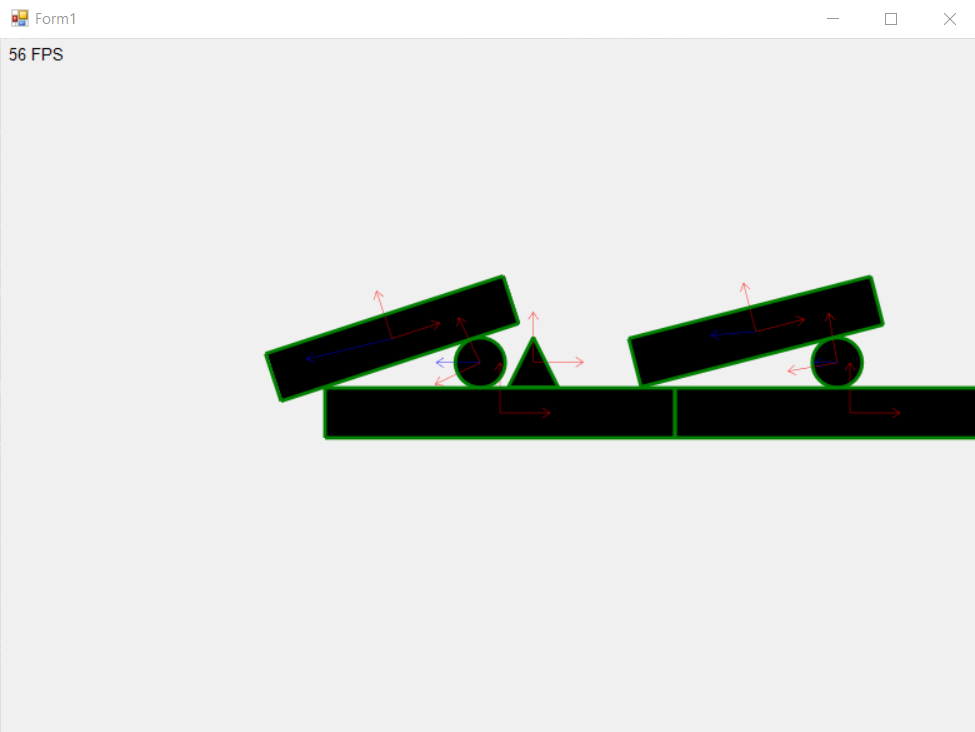
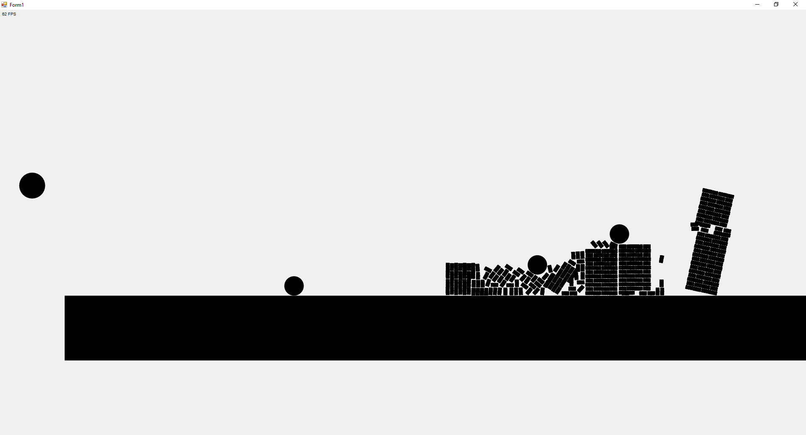

# GameProject
Игра, основанная на физике, в которой игроку предстоит строить осадные машины для разрушения замков, стоящих
по пути в игровом мире.

## Изображения
> 21 апреля

(Просто сцена для тестирования физики)

> 28 апреля

(Дебаг, нормальная система координат)

> 8 мая

(Модель разрушаемой кирпичной стены, многопоточность)

## Геймплей
В начале игрок оказывается линейном мире, на котором отмечены контрольные точки. На каждой точке открывается
редактор для постройки осадной машины, чтобы использовать оную для продвижения вперёд.
